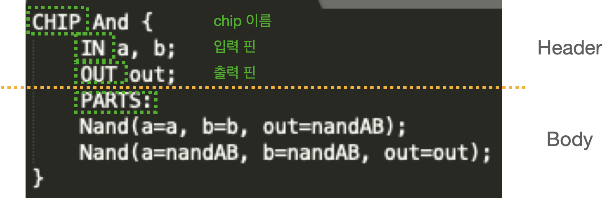

# HDL (Hardware Description Language)
하드웨어 기술 언어는 칩을 정의하고 테스트하는 형식 체계

## 규칙
이름이 XXX인 경우 XXX.hdl 파일에 해당 칩이 정의됨

- 칩 구조
    - 헤더(Header) : Chip의 Interface를 정의
    - 본문(Body) : 구현부

 

입력 및 출력 핀은 기본으로 폭이 1비트라고 가정

- 핀과 연결
    - 한 파트의 출력 핀과 다른 파트의 입력 핀을 연결하기 위해선 내부 핀(internal pin)을 생성해야 함
    - ex]
        - Part1(..., out=v)   // Part1의 out에 v가 연결됨 (v=내부 핀)
        - Part2(in=v, ...)   // v는 Part2의 in에 연결됨
    - 내부 핀은 HDL 프로그램에서 처음 명시될 때 필요에 따라 생성, 특별한 선언문은 필요하지 않음

# 테스트 스크립트 언어
- 하드웨어 시뮬레이터: HDL로 작성된 칩들을 시뮬레이션하고 테스트하는데 사용
- CPU 에뮬레이터: 기계어 프로그램을 시뮬레이션하고 테스트하는 데 사용됨
- VM 에뮬레이터: VM 언어로 작성된 프로그램을 시뮬레이션하고 테스트 하는 데 사용됨

<!--   -->